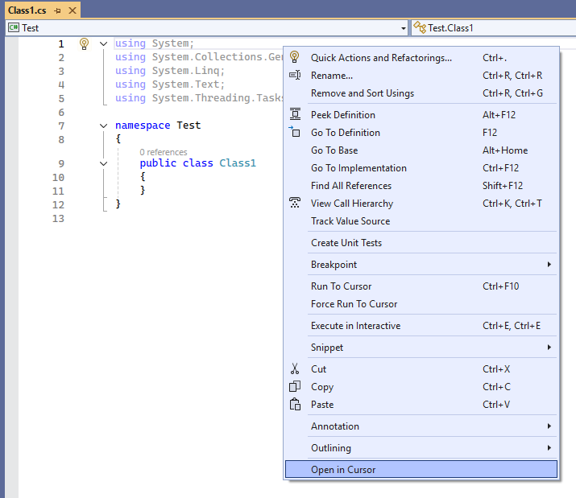

# Open in Cursor

A Visual Studio extension that allows you to quickly open files from Visual Studio in Cursor editor with a simple right-click context menu option.

## Features

- **Right-click Context Menu Integration**: Seamlessly integrated into Visual Studio's context menu
- **Direct File Opening**: Opens files directly in Cursor editor without any intermediate steps

## Screenshots

### Context Menu Integration

*Right-click on any file in Solution Explorer to see the "Open in Cursor" option*

## Installation

### From Visual Studio Marketplace
1. Open **Extensions** > **Manage Extensions** in Visual Studio
2. Search for "Open in Cursor"
3. Click **Download** and restart Visual Studio

### From VSIX File
1. Download the latest VSIX file from [Releases](https://github.com/muhammetkara/OpenInCursor/releases)
2. In Visual Studio, go to **Extensions** > **Manage Extensions**
3. Click **Install from VSIX** and select the downloaded file
4. Restart Visual Studio when prompted

## Prerequisites

- Visual Studio 2022 (Community, Professional, or Enterprise)
- Cursor editor installed on your system
- .NET Framework 4.7.2 or higher

## Usage

1. **Right-click** on any file in Solution Explorer
2. Select **"Open in Cursor"** from the context menu
3. The file will open directly in Cursor editor
.

## Contributing

Contributions are welcome! Please feel free to submit a Pull Request.

## License

This project is licensed under the MIT License - see the [LICENSE](LICENSE) file for details.

## Author

**Muhammet KARA**

## Planned Features

The following features are planned for future releases:

- **Settings Integration**: Add option to configure custom Cursor.exe location in Visual Studio settings
- **Solution Explorer Menu**: Add "Open in Cursor" option to Solution Explorer context menu for entire solutions and projects
- **Previous Visual Studio Versions Support**: Add compatibility with Visual Studio 2019 and Visual Studio 2017

## Version History

- **1.0.0** - Initial release
  - Basic right-click context menu integration
  - Direct file opening in Cursor editor

## Support

If you encounter any issues or have suggestions, please [open an issue](https://github.com/muhammetkara/OpenInCursor/issues) on GitHub. 