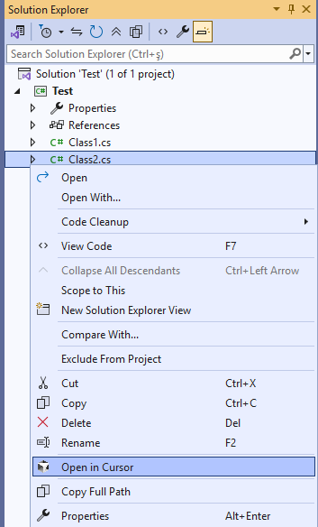

# Open in Cursor

A Visual Studio extension that allows you to quickly open files from Visual Studio in Cursor editor with a simple right-click context menu option.

## Features

- **Right-click Context Menu Integration**: Seamlessly integrated into Visual Studio's context menu
- **Code Editor Support**: Open currently active file in Cursor editor
- **Solution Explorer Integration**: 
  - Open individual files directly in Cursor
  - Open folders as workspace in Cursor
  - Open entire projects as workspace in Cursor
  - Open complete solutions as workspace in Cursor
- **Visual Menu Icons**: Clear visual icons in context menus for easy identification
- **Smart Path Detection**: Automatically detects Cursor installation location

## Screenshots

### Context Menu Integration

*Right-click on any file in Text Editor to see the "Open in Cursor" option*

### Solution Explorer Menu Integration

*Right-click on any item in Solution Explorer to see the "Open in Cursor" option*

## Installation

### From Visual Studio Marketplace
1. Open **Extensions** > **Manage Extensions** in Visual Studio
2. Search for "Open in Cursor"
3. Click **Download** and restart Visual Studio
## Usage

### From Code Editor
1. Open any file in Visual Studio
2. **Right-click** in the code editor
3. Select **"Open in Cursor"** from the context menu
4. The file will open directly in Cursor editor

### From Solution Explorer
1. **Right-click** on any item in Solution Explorer:
   - **Files**: Opens the file directly in Cursor
   - **Folders**: Opens the folder as a workspace in Cursor
   - **Projects**: Opens the project folder as a workspace in Cursor
   - **Solutions**: Opens the solution folder as a workspace in Cursor
2. Select **"Open in Cursor"** from the context menu
3. The selected item will open in Cursor editor

## Contributing

Contributions are welcome! Please feel free to submit a Pull Request.

## Planned Features

The following features are planned for future releases:

- **Settings Integration**: Add option to configure custom Cursor.exe location in Visual Studio settings
- **Previous Visual Studio Versions Support**: Add compatibility with Visual Studio 2019 and Visual Studio 2017

## Version History

- **1.1.0** - Solution Explorer Integration
  - Added "Open in Cursor" to Solution Explorer context menus
  - Support for opening files, folders, projects, and solutions
  - Added visual icons to all context menu options
  - Improved error handling and user feedback
  - Code refactoring and optimization

- **1.0.1** - Visual Updates
  - Updated extension logo and visual identity
  - Minor visual improvements

- **1.0.0** - Initial release
  - Basic right-click context menu integration
  - Direct file opening in Cursor editor

## Support

If you encounter any issues or have suggestions, please [open an issue](https://github.com/karascr/OpenInCursor/issues) on GitHub. 
